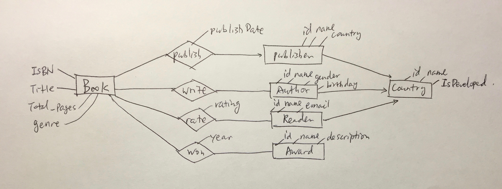

# CS564 Project 1
Team 6		
Buzun Chen (buzun)	
Shu Chen (schen)    
Zhuoren Shen (zhuoren)

## A.1
Supported queries: 

1. query books by publisher
2. query books by author (including books written by multiple authors)
3. query books by genre
4. query books by award and year
5. query book ratings by book ISBN
6. query book ratings by reader
7. query awards by book (get all the awards won by a certain book)

## A.2
The ER-diagram:

Book and publisher have many-1 relation (a publisher publishes many book, a book can only have 1 publisher).		
Book and author have many-many relation because a book can have more than 1 authors.		
Book and Reader, Book and Award also have many-many relation.	
Publisher, Author, Reader have many-1 relation with Country.

We found no weak entity sets because we want to assign unique IDs to each entry in every table.

## A.3
Please refer to `schema.sql`.

## B.1.1
Minimal cover

Use the following letter mapping: 
> Store = A		
> WeekDate = B	
> Temperature = C	
> Size = D	
> FuelPrice = E		
> CPI = F	
> UnemploymentRate = G	
> Type = H	
> IsHoliday = I		
> Dept = J	
> WeeklySales = K	

* Step 1: rewrite to letter representation	
	1. AB -> ABCDEFGH	
	2. ABD -> HI	
	3. A -> DH	
	4. ABIJ -> CFHI	
	5. ABJ -> BJK	
	6. B -> I	
	
* Step 2: 
	remove all self-inferences from right side (eg: AB -> AB)	
	1. AB -> CDEFGH	
	2. ABD -> HI	
	3. A -> DH	
	4. ABIJ -> CFH	
	5. ABJ -> K	
	6. B -> I

* Step 3: 	
	since (6) B -> I, remove I in (2), (4)	
	1. AB -> CDEFGH	
	2. ABD -> H	
	3. A -> DH	
	4. ABJ -> CFH	
	5. ABJ -> K	
	6. B -> I
	
	since (1) AB -> CDEFGH, we do not need ABJ to get CFH, so remove (4)	
	
	1. AB -> CDEFGH	
	2. ABD -> H	
	3. A -> DH	
	5. ABJ -> K	
	6. B -> I
	
	since (3) A -> DH, remove (2), also remove DH from right side of (1)
	
	1. AB -> CEFG
	3. A -> DH
	5. ABJ -> K
	6. B -> I

* Step 4: remap back to semantic version

	1. Store, WeekDate -> Temperature, FuelPrize, CPI, UnemploymentRate
	2. Store -> Size, Type
	3. Store, WeekDate, Dept -> WeeklySales
	4. WeekDate -> IsHoliday

## B.1.2
BCNF Normalization

Same letter mapping:
> Store = A		
> WeekDate = B	
> Temperature = C	
> Size = D		
> FuelPrice = E		
> CPI = F		
> UnemploymentRate = G	
> Type = H	
> IsHoliday = I		
> Dept = J	
> WeeklySales = K	

The minimal cover we optained in previous question is:

> A -> DH	
> B -> I	
> AB -> CEFG	
> ABJ -> K	

Necessary attributes for key: A, B, J	
(ABJ)+ = A B J C D E F G H I K	
ABJ is the only key

	R = {A B C D E F G H I J K}		
	Key(R) = ABJ
	
		R1 = {A D H}
		Key(R1) = A
	
		R2 = {A B C E F G I J K}
		Key(R2) = ABJ
		
			R21 = {B I}
			Key(R21) = B
			
			R22 = {A B C E F G J K}
			Key(22) = ABJ
			
				R221 = {A B C E F G}
				Key(221) = AB
				
				R222 = {A B J K}
				Key(222) = ABJ
				
Answer:

	R1 = {Store, Size, Type}
		Key(R1) = Store	
		# this relation is renamed to `Store` in B.1.3
			
	R21 = {WeekDate, IsHoliday}	
		Key(R21) = WeekDate	
		# this relation is renamed to `WeekDate` in B.1.3
				
	R221 = {Store, WeekDate, Temperature, FuelPrice, CPI, UnemploymentRate}
		Key(221) = Store, WeekDate	
		# this relation is renamed to `Attributes` in B.1.3
				
	R222 = {Store, WeekDate, Dept, WeeklySales}
		Key(222) = Store, WeekDate, Dept
		# this relation is renamed to `Sales` in B.1.3

## B.1.3
Please refer to `normalized.sql`

## B.2
Please run `run.py` to test our program. Details of our implementation is in `README.md`